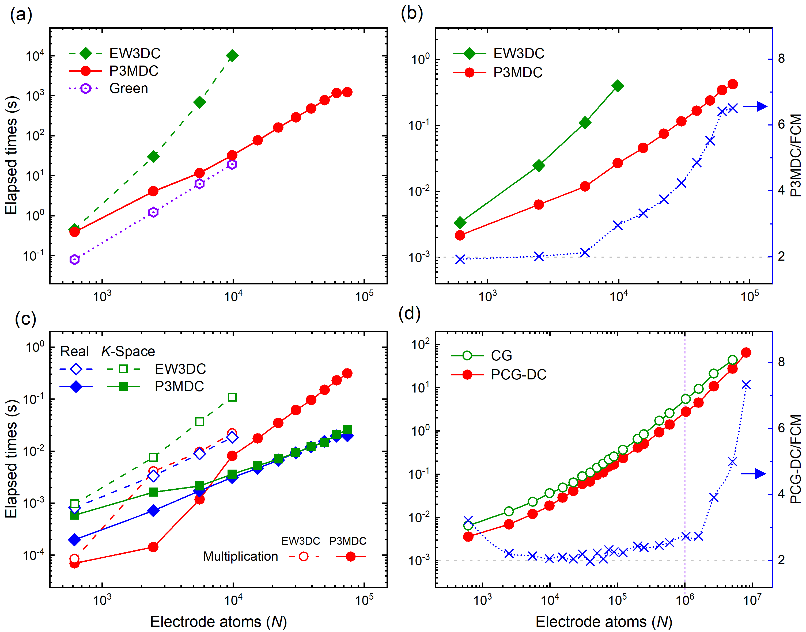
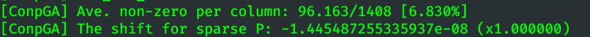
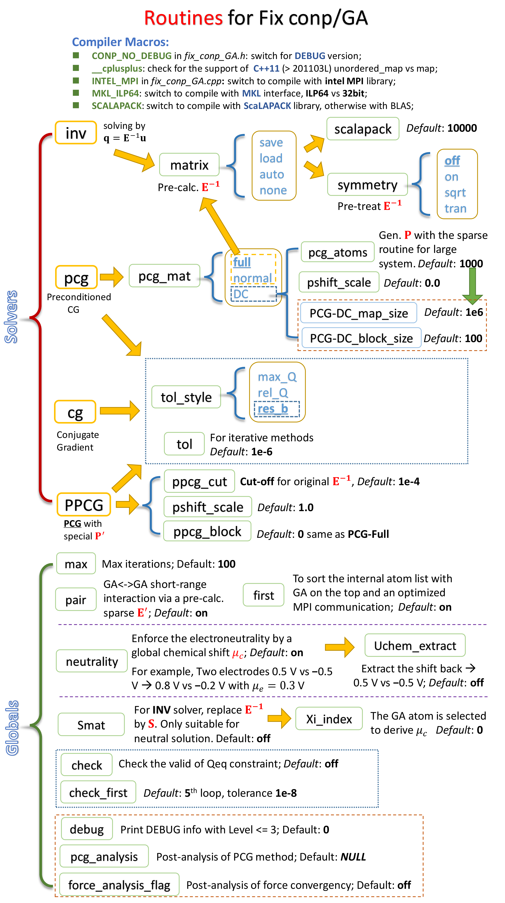

# LAMMPS Constant Potential Simulation for Graphene Electrode (**Conp/GA**)

A LAMMPS plugin for constant potential simulation

## Features

The **Conp/GA** package is designed to perform constant potential simulation in LAMMPS MD simulation package. This project is inspired by [Wang's work](https://github.com/zhenxingwang/lammps-conp) on the constant potential method (**CPM**) for the metal electrode.[[1]](#Ref.1) While, our package handles the charge polarization of graphene (GA) or other metallic materials using the LAMMPS's existing electrostatics code in KSPACE package rather than the extra Gaussian Ewald summation as proposed in the seminal Siepmann and Sprik’s work [[2]](#Ref.2) and later reformulated by Reed et al.[[3]](#Ref.3) Following the derivation by Gingrich and Wilson [[4]](#Ref.4) and Kiss et al. later [[4]](#Ref.4), the electrostatic calculation between a mixture of Gaussian and point charge can be efficiently handled using the existing particle mesh Ewald method (*e.g.*, PPPM) for point charges. With the incorporation of the Fast Fourier Transform (FFT), a $\mathcal{O}(N\log N)$ scaling of calculation cost is given in our project.

This project adds a new *pair_style* `lj/cut/point/long`, and two new *pppm* `conp/GA` and `la_conp/GA` to derive the electrostatic energy between the point and Gaussian charges, and a new *fix* `conp/GA` to derive the equilibrium electrode charge distribution, as well as the new *compute* `pe/atom_GA` to output the per-atom Coulomb energy. The validation of our project could be verification though the unit-test and it becomes fully compatible with LAMMPS (*e.g.* Supporting all `newton` and `units` options), with the following improvements and optimizations.

1. The preconditional conjugate gradient solver with a highly Parallel Divide-and-Conquer (DC) preconditioner generation process, *i.e.* **PCG-DC**
2. The universal Electroneutrality constraint for both matrix and iterative approaches.
3. The optimized methods to calculate the Ewald interaction matrix of $\mathbf{E}$ between the polarizable electrode charges, using *N*-times of Ewald summation, $\mathcal{O}(N^2\log N)$, or Ahrens-Iwers’s intermediate matrix method, $\mathcal{O}(N^2)$ [[6]](#Ref.6). Nevertheless, the prohibitive memory cost of the intermediate matrix method is circumvented in our method.
4. Constant charge constraint on the conducting electrode.
5. Feasible for a dynamics and per-atom constraint to resemble the realistic electrochemical charging and controlling process, such as constant voltage charging (CV), galvanotactic charging and even impedance spectroscopy investigation.
6. The optimized KSPACE style to accelerate the reciprocal space calculation with the some pre-calculation for the immobilized electrode atoms.

Any suggestions on the future features are welcome. Please cite our paper [[8]](#Ref.8) if using this **Conp/GA** code in your work.



​                                          Figure: The computation efficiency for **conp/GA**

## Dependence

This project is currently only compatible with LAMMPS 29Sep2021 version and later. To solve the Linear algebra problem, the **BLAS** and **LAPACK** library is required. To accelerate the calculation of the matrix inversion, the **SCALAPACK** library could be extra employed with the compilation macro of `-DSCALAPACK`

## Known issues

Not compatible with `atom_modify first [group]` command. Because, the atomic list in each core could be sorted to move the electrode atoms to the front.

Note tat a NIL `compute pe/atom_GA` with the compute name of `__Electro_Control_GA_Compute__` is added in the background by `pair_style lj/cut/point/long` to invoke a per-atom allocate for `eatom` in `pair`.

## Installation

1. Download **package** to [LAMMPS home directory] as *package-conp-GA*
2. Edit **makefile** in *package-conp-GA* folder and change **LMP_MAKE** as your LAMMPS make options, *e.g.* `LMP_MAKE=intel_cpu_intelmpi`
3. Add linear algebra library dependencies for **BLAS**, **LAPACK** or optional **SCALAPACK** into the makefile, either in the **package-conp-GA** (or in LAMMPS's original makefile). For INTEL MKL library, using the following configuration into the line of `SCALAPACK_LIB =` (or`LIB` =) as `SCALAPACK = -lmkl_intel_ilp64 -lmkl_scalapack_ilp64 -lmkl_blacs_intelmpi_ilp64 -lmkl`.
4. Add the necessary compilation macro at the line `CONP_MACRO =` (or`FFT_INC =`)  or , such as, `-DCONP_NO_CONP` to compile a **RELEASE** version, otherwise a **DEBUG** version is built; `-DFFT_DOUBLE` for double accuracy FFT which decrease the level of relative error from 1e−6 to 1e−12; `-DSCALAPACK` for the **SCALAPACK** library; `-DFFT_MKL` for FFTW library from **MKL**; `-DMKL_ILP64` for the extended **ILP** interface for **MKL** and `-DINTEL_MPI` for the compilation with **Intel MPI**.
5. Go to the folder of *package-conp-GA* and Type `make` command to compile the package that copies the code from *src_mod* into LAMMPS *src* folder and build the LAMMPS.
6. Type `make test` command to verify the functions of the build LAMMPS.  Change the line of `LAMMPS=...` in `package-conp-GA/tests/config.ini` as the location of the compiled LAMMPS binary file.

**Otherwise**, copy all files in the `src_mod` folder to `src` and edit the`src\MAKE\OPTION\Makefile.XXX `. Then, type `make XXX` in the `src` folder. Here, **Makefile.intel_cpu_intelmpi** is also provided in `misc` folder as an example for installation configuration.

Note that the default **single** precision of the FFTW setup is not higher enough for constant potential simulation that results in the order of error of 1e-6. To improve the accuracy, we suggests to switch to  **double** precision using the macro of `-DFFT_DOUBLE`. Thus, if the error of `undefined reference to 'LAMMPS_NS::FFT3d::compute(double*, double*, int)'` is encountered, type `make clean-XXX` to remove the existing **single** precision FFTW library and recompile it.

## Syntax: pair_style lj/cut/point/long

The new pair_style (`lj/cut/point/long`) can be invoked independently in LAMMPS as an extension to account for Gaussian charge interaction and the point-Gaussian mixture interaction. In default, all the charges are regarded as the point charge as same the default `lj/cut/point/long`

```
pair_style lj/cut/point/long [lj-cut] [coul-cut] point [type-ID] [α_{self}] 
gauss [type-ID] [α] eta [type-ID] [α] [α_{self}] sv_SOL [on/off] sv_GA [on/off]

pair_style lj/cut/point/long 10 10 point 1 2.934 point 2 2.934
pair_style lj/cut/point/long 10 10 gauss 1 2.934 eta 2 3 2.934 eta 3 1e20 2.934
```

`[lj-cut]` = Cut-off for short-range LJ interaction
`[coul-cut]` = Cut-off for short-range Coulombic interaction
`[type-ID]` = ID of atom type id in [1, n].
`[α]` = Reciprocal width of the Gaussian charges, determining the short-range screening of electrostatic interactions, *i.e.*, $\mathrm{erf}(\alpha_{ij}|\mathbf{r}|)$.
`[α_{self}]` = Self-energy for the point or the Gaussian charges, given by $\Delta_\mathrm{self}=\sqrt{2/\pi}\alpha_\mathrm{self}$

`eta` = set `[type-ID]`th type of atom as the Gauss charge with different $\alpha$ and $\alpha_\mathrm{self}$. Specifically, with $\alpha>10^{20}$, the atom would be treated as the point charge same as the option of `point [type-ID] [α_{self}] ` 

`point` = set `[type-ID]`th type of atoms as the point charge, except for a non-singular self-energy of $\Delta_\mathrm{self}$

`gauss` = set `[type-ID]`th type of atoms as the Gauss charge with $\alpha=\alpha_\mathrm{self}$.
For Graphene, suggest to set $\alpha_\mathrm{self}=$ 2.93295072600296 Å^-1^ at $a=$ 1.420 Å for both point and Gaussian charge. For other 2D lattice refer to the following **Table 1**.

`sv_SOL `= Keyword to control the storage of pairwise interaction between electrode and electrolyte interaction. Note that the acceleration of this keyword depends on the machine and types of simulation setup. *Default*: **off**

` sv_GA [on/off] `= Keyword to control the force calculation on the electrode atoms by `sv_GA on`, otherwise `sv_GA off` the forces and (vdw) energy on the electrode atoms would be incorrect. *Default*: **off**

**[Default]**: `sv_SOL off` and  `sv_GA off`

## Syntax: pppm_conp/GA & pppm_la_conp/GA

```
kspace_style 	pppm_conp/GA [accuracy] | sv_SOL [on/off] fixed [on/off]
kspace_style 	pppm_la_conp/GA [accuracy] | sv_SOL [on/off] fixed [on/off] sv_Xuv [on/off]

kspace_style 	ewald 1e-4
kspace_style 	pppm 1e-4
kspace_style 	pppm_conp/GA 1e-4 sv_SOL on fixed on
kspace_style 	pppm_la_conp/GA 1e-4 sv_SOL on fixed on su_Xuv off
```

`sv_SOL [on/off]` = Keyword to control whether the charges on the mesh grid from the solvent molecule is pre-stored in every MD step. *Default*: **off**

`fixed [on/off]` = Keyword to prevent the re-optimization of the P3M parameter between the successive `run`  invoking. The re-optimization of P3M parameters changes the structure of $\mathbf{E}$ and enlarges the error in the matrix inversion solver. *Default*: **on**

`sv_Xuv[on/off]` = Keyword to apply the intermediate FFT matrix $X_{\mu\nu}$ for the electrode potential calculation (only available in `pppm_la_conp/GA`). *Default*: **off**

Although the **conp/GA** package is feasible with all existing LAMMPS KSPACE solver, our **pppm_conp/GA**  code is specifically optimized for the immobilized electrode atoms. **pppm_la_conp/GA** is added to implement the intermediate matrix approach [[6]](#Ref.6) for $\mathbf{E}$ and electrode potential calculation. 

**[Default]**: `sv_SOL off`, `fixed on` and `sv_Xuv off`.

## Syntax: compute pe/atom_GA

```
compute 	[compute-name] [group-name] pe/atom_GA coul kspace
```

The new compute style to calculate the per-atom energy of the real space (`coul`) or the energy from the reciprocal space (`kspace`) and other per-atom energy. `coul` is only compatible with the using of`lj/cut/point/long`

## Syntax: Fix conp/GA

```
fix			[fix-name] [group-name] conp/GA [Nevery] [solver] metal [type-ID] [U] charge [type-ID] [Q] | neutrality [on/off] units [lmp/eV] Vext_update [on/off] pair [on/off] first [on/off] Uchem_extract [on/off] [Options...]

fix			conp ele conp/GA 1 inv metal  1 1.0      metal  2 -1.0
fix 		conp ele conp/GA 1 cg  metal  2 ${lPot}  metal  3 v_rPot metal 4 v_z
fix 		conp ele conp/GA 1 pcg charge 3 -0.5     charge 4 v_Q
```

`[fix-name]` = Tag of `conp/GA` fix

`[group-name]` = Group name for all electrode atoms. Note that the fix group must contain all electrode atoms involved in the following `metal` and `charge` options

`[Nevery]` = Take charge equilibrium calculation at every `[Nevery]` timesteps 

`metal [type-ID] [U]`= All `[type-ID]`th type of atoms are treated as a single conducting electrode constrained at the potential of `[U]`.  For example, `metal 1 1.0` indicates we apply the 1.0 voltage constraint on to a electrode, which is composed of **all 1^st^ type** atoms.

`charge [type-ID] [Q]`= All `[type-ID]`th type atoms are treated as an isolated conducting electrode with a conservation of total charge of `[Q]`.  For example, `charge 1 -0.5` indicates the total charge on all 1st type of atoms as a equipotential electrode is −0.5 e.

`neutrality [on/off]` = Switch to enforce the global electroneutrality for both electrode and electrolyte charges. *Default*: **on** 

`Vext_update [on/off]` = Switch to updates the constraint values of `[U]` or `[Q]` during the simulation.  At `off` state, the constraint value is fixed, otherwise the constraint could be dynamically changed. For example, `metal 1 v_rG Vext_update on` would change the potential constraint on the 1st type of atoms. *Default*: **off**

` Uchem_extract [on/off] ` = Switch to allow to remove the influence of the electroneutrality constraint. For example, at the constraint of $\pm0.5$ V for the cathode and anode, the potential on the electrodes would be $+0.7$ V and $-0.3$ V to meet the electroneutrality condition. The apply of `on` would shift the electrochemical potential for all charges that recovers the value of $+0.5$ V and $-0.5$ V on the cathode and anode, respectively.

`units [lmp/eV]` = Switch to determine the potential unit `[U]`.  At `eV`, the unit of the input `[U]` is ***voltage***, otherwise the unit of “energy per electron” is applied. For example, in the LAMMPS `units real` setup, the option of `lmp` makes the potential unit as “kcal/mol•e^−1^”. *Default*: **eV** 

Note that there is no limitation on the number of the electrodes, *i.e.* the number of `metal` or `charge`. But the group `[group-name]` of atoms must equal **all** the electrode atoms constrained. However, the current implementation is not supporting for a mixture studies with both `metal` and `charge` constraints. Besides, the input variables of `[U]` or `[Q]` could be dynamically updated using the LAMMPS variables, especially, `[U]` support the atomic variable, *e.g.* `metal 1 v_z` would constrain the potential on the electrode atom of 1^st^ type based on their *z*-positions. The switch of `Vext_update` controls the update of constraints during the simulation, which resemble the practical electrochemical applications.

**[Default]**: `neutrality on`, `Vext_update off`, `units eV`

#### Electrostatics Setup

```
Keywords:       pair  [on/off]        first  [on/off]      selfGG  [on/off]  

fix				conp ele conp/GA 1 inv metal  1 1.0  metal  2 -1.0 pair on selfGG on first on
```

`pair [on/off]` = Switch to accelerate the calculation of the real space interaction between the electrode atoms, using a pre-calculated sparse matrix. *Default:* **on**

`first [on/off]` = Switch to allow to resort the sequence of the atom list. It facilitates to invoke a optimized MPI communication specified for the immobilized electrode atoms, instead of the default global implementation involving *all atoms*. *Default:* **on**

`selfGG [on/off]` = Whether or not the interaction between the electrode atoms is included in the CPM equation. With `on` option, the relative change of the electrode charge between the successive MD step is calculated as $\mathbf{Eq}=\mathbf{b}^\mathrm{sol}+\mathbf{b}^\mathrm{ele}$.  Otherwise (`off` option),  $\mathbf{q}$ is given as $\mathbf{E}\Delta\mathbf{q}=\mathbf{b}^\mathrm{sol}$. *Default*: **off**

Note that `pair on` option would considerably accelerate the simulation. While `first on` may slightly improve the performance, as well as `selfGG off`. The later switch skips part of the calculation between the electrode atoms, but it is only compatible with `pppm conp/GA` or `pppm la_conp/GA`

**[Default]**: `pair on`, `first on`, `selfGG off`

------------------

#### Solver [1]: Matrix Inverse - INV

```
Keywords:   matrix [mat-name].[txtmat/binmat] [mat-op: save/load/auto/none]  
            scalapack [scalapack-num] SCALAPACK_BSize [BSize-num]
            Smat [on/off]

fix			conp ele conp/GA 1 inv metal 1 1.0 matrix mat0.txtmat save
fix			conp ele conp/GA 1 inv metal 1 1.0 metal 2 -1.0 matrix mat.binmat auto
```

The matrix inversion solver (**INV**) is proposed to calculate the equilibrium electrode charges, using $\mathbf{q}=\mathbf{E}^{-1}\mathbf{b}$. Whereas, the calculation of $\mathbf{E}$ is controlled by `matrix` option

`[mat-name].[txtmat/binmat]`= Name of the saved matrix file with a fixed extension either `.txtmat` or `.binmat` for the text and the binary files, respectively. Note that the inverse of the Ewald interaction matrix of $\mathbf{E}^{-1}$ is saved.

`[mat-op: save/load/auto/none]` = Operations for matrix file: `[save]` = always generate $\mathbf{E}$ and write it down; `[load]` = only load from the existing file, error if matrix file doesn’t exit; `[auto]` = load $\mathbf{E}$ from the matrix file, if not existing, to generate new matrix file; `[none]`=generate $\mathbf{E}$ without file saving. *Default*: `matrix a.binmat save` 

`scalapack [scalapack-num]`=Switch to inverse $\mathbf{E}$ using SCALAPACK. Once the number of electrode atom is large than`[scalapack-num] `, $\mathbf{E}$ is inversed via the parallel SCALAPACK routine. *Default*: **10000**

`SCALAPACK_BSize [BSize-num`=Block size for the distributed block cyclic matrix in SCLAPACK. *Default*: **128**

**[Default]**: `matrix a.binmat save`, `scalapack 10000`, `SCALAPACK_BSize 128`  and `Smat off`

------------

#### Solver [2]: Conjugate Gradient - CG

```
Keywords:   tol [tol-value]   max [maxloop]   tol_style [rel_B/max_Q/rel_Q]

fix			conp ele conp/GA 1 cg metal 1 1.0 tol 1e-6 max 100 tol_style rel_B
fix			conp ele conp/GA 1 cg charge 1 0.5 tol 1e-6 max 200 tol_style rel_Q
```

To solve the CPM problem using the conjugate gradient method (CG).

`tol [tol-value]` = Relative tolerance during CG. *Default*: **1e-6**

`max [maxloop]` = Maximum number of iteration loops. *Default:* **100**

`tol_style [rel_B/max_Q/rel]` = Styles of the toleration: `rel_B`=the relative change of the interaction energy between electrode and electrolyte; `max_Q`=the maximum absolute change of the electrode charge during the iterative solving; `rel`=the maximum relative change of the residual; Note that the using of `rel_B` required `selfGG` to be set as `off`. *Default*: **rel_B**

Note that all the keywords for **cg** solver is also applied for the following PCG and PPCG solvers.

**[Default]**: `tol 1e-6`, `max 100` and `tol_style rel_B`

------------

#### Solver [3]: Preconditioned Conjugate Gradient - PCG

```
Keywords:  	pcg_mat [full/normal/DC...] pcg_atoms [pcg_atoms-value] pshift_scale [shift-value]

fix			conp ele conp/GA 1 pcg tol 1e-8 max 100 metal 1 1.0 pcg_mat full pshift_scale  1.0
fix			conp ele conp/GA 1 pcg tol 1e-8 charge 1 0.5 pcg_mat DC 0.079 1e-6
```

`pcg_mat [full/normal/DC...]` = Methods to generate preconditional matrix $\mathbf{P}$. *Default:* **normal**

- `[full]`=Sparsify $\mathbf{E}^{-1}$ matrix by preserving the interaction of two electrode atoms in the same neighbor cell list.
- `[normal]`=Sparsify $\mathbf{E}^{-1}$ matrix  by preserve the interaction of two electrode atoms within the coulomb cutoff `[coul-cut]`.
- `[DC g-value DC-tol] `= Generate $\mathbf{P}$ via a Divided and Conquer (DC) process, *i.e.*, PCG-DC. `[g-value]` controls the screening between the electrode atom in $\mathbf{P}$ generation and `DC-tol` controls the inversion tolerance for the divided local matrix. 

`pcg_atoms [pcg_atoms-value]` = Keyword to invoke the sparse routine for $\mathbf{P}$ calculation in PCG-DC approach with much less memory cost if the number of the electrode atoms is larger than `[pcg_atom-value]`. *Default*: **1000** . Other related options for PCG-DC as `DC_block_size 100` and `PCG-DC_map_size 1000000`.

`pshift_scale [shift-value]` = Magnitude of the shift for each entry in $\mathbf{P}$. For example at `pshift_scale 1.0`, the sum of $\mathbf{P}$ would be the same as that of $\mathbf{E}^{-1}$ as $\sum_{ij}p_{ij}=\sum_{ij}e_{ij}^{-\hat1}$ . *Default*: **0.0**

Generally speaking, the efficiencies of PCG-Normal or PCG-Full methods are about 1.5~2.0 times better than the conventional CG approaches. However, both PCG methods required the known of $\mathbf{E}$, involving the`matrix` option, which could be circumvented by PCG-DC method. With a proper choice of `[g-value]`, the performance of PCG-DC would be compatible with the formers. $\mathbf{P}$ calculation in PCG-DC is highly parallel and optimized which only costs ~79 seconds for the simulation of 8.1 million electrode atom using 24 processes. Moreover, the performance would also be marginally improved with `[shift-value]`=1.0.

**[Default]**: `pcg_mat normal`, `pshift_scale 0.0` and `pcg_atoms 1000`

------------------------

#### Solver [4]: Partitioned Preconditioned Conjugate Gradient - PPCG

```
Keywords:  	ppcg_cut [p-cut] ppcg_block [block-num]

fix			conp ele conp/GA 1 ppcg metal 1 1.0 ppcg_block 4 ppcg_cut 0.06
```

`ppcg` solver generates $\mathbf{P}$ from the calculated $\mathbf{E}$ with the extra compensation on the removed element. Note that the $\mathbf{E}^{-1}$ matrix is firstly sparsified by the elements' value, only the entries with the value larger than `[p-cut]` is reserved. 

Then, the removed elements are evenly partitioned into $2^{\mathrm{M}}$ blocks with $2^{M-1}<\mathrm{[block-num]}\leq2^{\mathrm{M}}$ and elements in each block are presented by their average values. The average values of these block would further accelerate the convergent of PCG process, using 

To optimize the efficiency of PPCG, the value of `[p-cut]` should be adjusted to preserve the adequate number of elements. The rate of reservation is given as



 Note that the case of `[block-num] = 0` for PPCG solver is similar to the case of PCG solver with the extra option of `pshift_scale 1.0`. Thus the default configuration of `pshift_scale` in PPCG is set to be `1.0`

**[Default]**: `ppcg_cut 1e-4`,`ppcg_block 0`, and `pcg_shift_scale 1.0`

-----------------------------

#### Debug and Checking

```
Keywords:  	debug [debug_level] check [on/off] check_first [first-step] [check-tol]

fix			conp ele conp/GA 1 ppcg metal 1 1.0 debug 0 check on check_first 3 1e-12
```

`debug` = Keyword allows to print debug information at `[debug_level]`$\neq0$. *Default*: **0**

`check [on\off]` = Keyword allows to check the accuracy of CPM solution. At `[on]` option, the potential is rechecked at every `[Nevery]` timestep.

`check_first [first-step] [check-tol]`= Keyword controls the potential check. After `[first-step]`th timestep, the simulation may stop with the error larger than the failure criterion of `[check-tol]`. For example, `check on check_first 3 1e-12` would check the result after 3rd MD timestep. Once the relative error of the electric potential on **any** electrode atom is larger than 1e−12, the simulation would stop with failure information. For a new system, we always suggested the user to check their script and their LAMMPS compilation with this keyword for ~1000 MD steps. *Default*: **5 1e−8**.

#### MISC

`Xi_index [GA-index]` = `[GA-index]`th electrode atom is select to calculate the Ewald potential of the simulation cell at origin point, *i.e.* the value of $\psi(\mathbf{0})$ or the Madelung constant of the cell. In `Smat on` model, the electrode atom is selected to derive the chemical potential shift $\mu_c$ by the electroneutrality constraint. *Default*: **0**

`delta_cut [d-cut]`= Keyword decreases the Coulomb cutoff during the $\mathbf{P}$ calculation in PCG-Normal. *Default*: **0.0**

`DEBUG_GAtoGA [on/off]` = Keyword to debug the internal electrode-electrode interaction. *Default*: **on**

`DEBUG_SOLtoGA [on/off]` = Keyword to debug the internal electrolyte-electrode interaction. *Default*: **on**

`symmetry [on/off/sqrt/tran]` = Make $\mathbf{E}^{-1}$ matrix symmetric by different methods. *Default*: **none**

`max_lwork [lwork]` = Keyword to limit the maximum **lwork** below `[lwork]`in the LAPACK or SCALAPACK matrix inversion routine. *Default*: **inf**

`max_liwork [liwork]` = Keyword to limit the maximum **liwork** below `[liwork]` in the SCALAPACK matrix inversion routine. *Default*: **inf**

`printf_me [work-proc]` = Keyword controls the `[work-proc]`th processor to output the convergent information during the (P)CG approaches. Default: **-1**

`INFO [on/off]` = Keyword allows to print comprehensive configuration information for **Conp/GA fix**. *Default*: **off**




#### Table 1: A summary of SR-CPM parameters in the different 2D lattices

| Lattice | $R_\mathrm{1rm}$ | Density | $U^\mathrm{Latt}$ | $\alpha_i^{0}$ | $\alpha_{ii}^{0}$ | $\mathrm{erfc}(\alpha_{ii}^0R_\mathrm{1nn})$ |
| :-----: | :--------------: | :-----: | :---------------: | :------------- | :---------------- | -------------------------------------------- |
| **GRA** |      1.000       |  0.770  | 3.32302166466011  | 4.165          | 2.945             | 0.0000312                                    |
| **SQ**  |      1.000       |  1.000  | 3.90026492000196  | 4.888          | 3.457             | 0.0000010                                    |
| **HEX** |      1.000       |  1.155  | 4.21342263613691  | 5.281          | 3.734             | 0.0000001                                    |
| **GRA** |      1.420       |  0.382  | 2.34015610187332  | 2.934          | 2.074             | 0.0000312                                    |
| **SQ**  |      1.619       |  0.382  | 2.40987666959325  | 3.02           | 2.136             | 0.0000010                                    |
| **HEX** |      1.739       |  0.382  | 2.42270787123462  | 3.036          | 2.147             | 0.0000001                                    |


## References

<span id="Ref.1">[1]</span> Z. Wang, Y. Yang, et al., *J. Chem. Phys.* **141**, 184102 (2014). http://dx.doi.org/10.1063/1.4899176

<span id="Ref.2">[2]</span> J. I. Siepmann, and M. Sprik, *J. Chem. Phys.* **102**, 511 (1998). https://doi.org/10.1063/1.469429

<span id="Ref.3">[3]</span> S. K. Reed, O. J. Lanning, and P. A. Madden, *J. Chem. Phys.* **126**, 084704 (2007).                 https://doi.org/10.1063/1.2464084

<span id="Ref.4">[4]</span> T. R. Gingrich and M. Wilson, *Chem. Phys. Lett.* **500**, 178 (2010). https://doi.org/10.1016/j.cplett.2010.10.010

<span id="Ref.5">[5]</span> P. T. Kiss, M. Sega and A. Baranyai, *J. Chem. Theory Comput.* **10**, 5513 (2014). https://doi.org/10.1021/ct5009069

<span id="Ref.6">[6]</span> L. JV Ahrens-Iwers, and R. H. Meißner, *J. Chem. Phys.* **155**, 104104 (2021). https://doi.org/10.1063/5.0063381

<span id="Ref.7">[7]</span> Scalfi, Laura, et al., *Phys. Chem. Chem. Phys.* **22**, 10480 (2020). https://doi.org/10.1039/C9CP06285H

<span id="Ref.8">[8]</span>H.Y. Li, G.P. Jiang, et al., *arXiv:2111.06704* (2021) https://arxiv.org/ab/2111.06704
